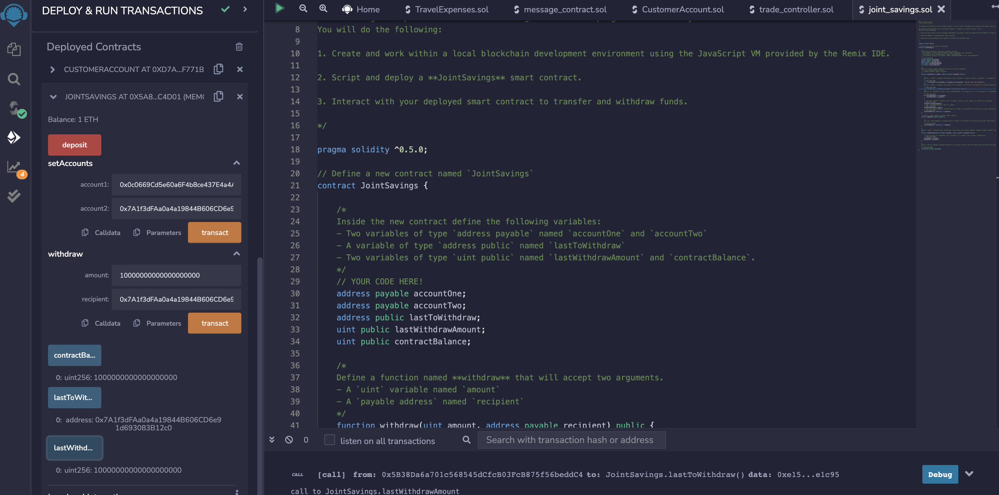

# Solidity_Smart_Contract

Solidity Smart Contracts is an example of smart contracts designed to automate institutuions financial processes and features, such as
hosting joint savings accounts. To automate the creation of the joint savings accounts I have created a Solidity smart contract
that accepts two user addresses. These addresses are able to control a joint savings account. This smart contract uses ether management
functions to implement a financial institution's requirements for providing the features of the joint savings account and will consist of 
the ability to deposit and withdraw funds from the account.

# Installations

No installations are necessary for this project. The web version of the IDE was used.

# Technologies

* [Remix IDE](https://remix-project.org/) - The Remix Project is a rich toolset which can be used for complete
contract development.

# Usage

The following images are functions in use, please see image descriptions.

### The `setAccounts` function is used to define the authorized Ethereum adress used to withdraw funds from contract.

### Transaction 1 : 1 ether was sent. The `contractBalance` function was used to verify funds where added to contract.

### Transaction 2 : 10 ether was sent. The `contractBalance` function was used to verify funds where added to contract.

### Transaction 3 : 5 ether was sent. The `contractBalance` function was used to verify funds where added to contract.

### Transaction 4 : 5 ether was withdrawn into `accountOne`. The `contractBalance` function was used to verify funds as well as the `lastToWithdraw` and `lastWithdrawAmount` functions to verify that the address and amount were correct.

### Transaction 5 : 10 ether was withdrawn into `accountTwo`. The `contractBalance` function was used to verify funds as well as the `lastToWithdraw` and `lastWithdrawAmount` functions to verify that the address and amount were correct.

# License
[MIT](license)

## Contributers
Hugo Velazquez

linkedin.com/in/hugoghvelazquez
